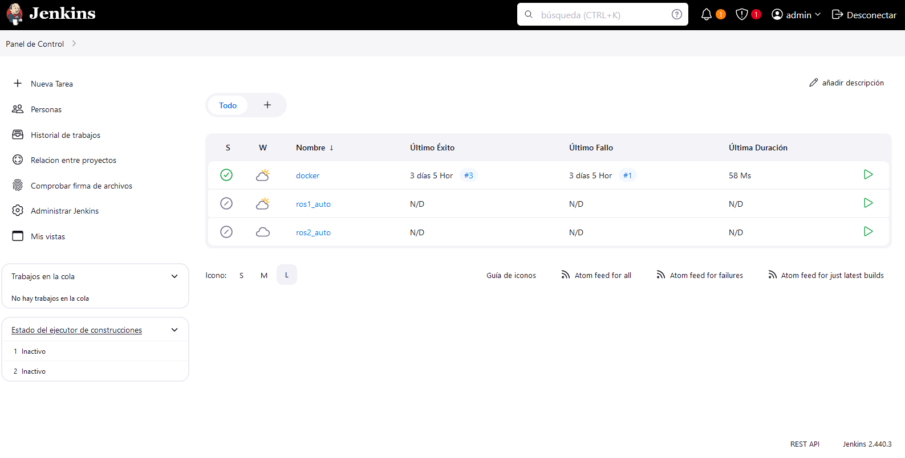

# tortoisebot_jenkins

Check README.md file in each submodule 

## ***[Link to the ROS1 Automation with Tortoisebot](https://github.com/Andy-Leo10/tortoisebot_ros1_ci)***

Keywords: python, unittest, rostest 

## ***[Link to the ROS2 Automation with Tortoisebot](https://github.com/Andy-Leo10/tortoisebot_ros2_ci-)***

Keywords: testing, docker, jenkins 

